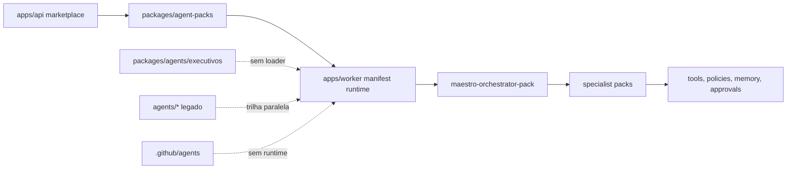
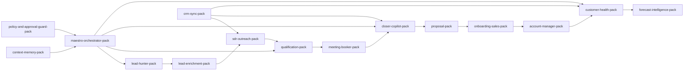

# Auditoria Massiva de Agentes - 2026-03-24

## Veredito Executivo
- Total auditado: **419 agentes/definições** em quatro famílias canônicas.
- Merecem existir como entidades canônicas hoje: **27**.
- Devem ser consolidados antes de continuar crescendo: **58**.
- Devem ser removidos: **334**.
- Evidência central: o runtime real do produto carrega **`packages/agent-packs`** via `apps/api/src/modules/marketplace/marketplace-service.ts` e `apps/worker/src/agents/runtime.shared.ts`; `.github/agents` e `packages/agents` não têm integração equivalente.

## Score do Sistema
| Dimensão | Nota |
| --- | ---: |
| Clareza | 52 |
| Coerência | 34 |
| Organização | 30 |
| Escalabilidade | 49 |
| Governança | 61 |
| **Nota final** | **43** |

## Inventário por Família
| Família | Total | Ativo | Potencial | Morto | Manter | Consolidar | Remover |
| --- | ---: | ---: | ---: | ---: | ---: | ---: | ---: |
| `.github/agents` | 334 | 0 | 3 | 331 | 0 | 3 | 331 |
| `agents/` | 27 | 1 | 26 | 0 | 0 | 24 | 3 |
| `packages/agent-packs` | 43 | 43 | 0 | 0 | 27 | 16 | 0 |
| `packages/agents` | 15 | 0 | 15 | 0 | 0 | 15 | 0 |

## Agentes a Manter
- `BirthHub 360 Official Collection`
- `Maestro Orchestrator`
- `Policy & Approval Guard`
- `Context Memory Bot`
- `Knowledge Bot`
- `Communication Bot`
- `CRM Sync Bot`
- `Lead Hunter Bot`
- `Lead Enrichment Bot`
- `SDR Outreach Bot`
- `Qualification Bot`
- `Meeting Booker Bot`
- `Closer Copilot Bot`
- `Objection Handling Bot`
- `Proposal Bot`
- `Follow-up Bot`
- `Account Manager Bot`
- `Customer Health Bot`
- `Onboarding Sales Bot`
- `Pipeline Auditor Bot`
- `Deal Risk Bot`
- `RevOps Intelligence Bot`
- `Forecast Intelligence Bot`
- `KPI Analyst Bot`
- `Finance Agent Pack`
- `Legal Agent Pack`
- `Admin Ops Bot`

## Tabela Mestre
Arquivo completo: [`audit/agents_master_table_2026-03-24.csv`](./agents_master_table_2026-03-24.csv)

| Nome | Status | Qualidade | Uso | Ação |
| --- | --- | --- | --- | --- |
| advocacy-finder.agent | Confuso | Ruim | Morto | Remover |
| audit-bot.agent | Confuso | Ruim | Morto | Remover |
| board-prep-ai.agent | Confuso | Ruim | Morto | Remover |
| brand-guardian.agent | Confuso | Ruim | Morto | Remover |
| budget-fluid.agent | Confuso | Ruim | Morto | Remover |
| cap-table-manager.agent | Confuso | Ruim | Morto | Remover |
| capital-allocator.agent | Confuso | Ruim | Morto | Remover |
| cash-flow-clairvoyant.agent | Confuso | Ruim | Morto | Remover |
| churn-deflector.agent | Confuso | Ruim | Morto | Remover |
| competitor-x-ray.agent | Confuso | Ruim | Morto | Remover |
| crisis-navigator.agent | Confuso | Ruim | Morto | Remover |
| culture-pulse.agent | Confuso | Ruim | Morto | Remover |
| escalation-predictor.agent | Confuso | Ruim | Morto | Remover |
| expansion-mapper.agent | Confuso | Ruim | Morto | Remover |
| journey-architect.agent | Confuso | Ruim | Morto | Remover |
| market-sentinel.agent | Confuso | Ruim | Morto | Remover |
| narrative-weaver.agent | Confuso | Ruim | Morto | Remover |
| pipeline-oracle.agent | Confuso | Ruim | Morto | Remover |
| pricing-optimizer.agent | Confuso | Ruim | Morto | Remover |
| quota-architect.agent | Confuso | Ruim | Morto | Remover |
| sentiment-aggregator.agent | Confuso | Ruim | Morto | Remover |
| spend-controller.agent | Confuso | Ruim | Morto | Remover |
| tax-optimizer.agent | Confuso | Ruim | Morto | Remover |
| trend-catcher.agent | Confuso | Ruim | Morto | Remover |
| vip-concierge.agent | Confuso | Ruim | Morto | Remover |
| agency-auditor.agent | Confuso | Ruim | Morto | Remover |
| board-reporting-automator.agent | Confuso | Ruim | Morto | Remover |
| bottleneck-detector.agent | Confuso | Ruim | Morto | Remover |
| burn-rate-monitor.agent | Confuso | Ruim | Morto | Remover |
| capacity-planner.agent | Confuso | Ruim | Morto | Remover |
| channel-mixer.agent | Confuso | Ruim | Morto | Remover |
| compliance-enforcer.agent | Confuso | Ruim | Morto | Remover |
| deal-desk-autopilot.agent | Confuso | Ruim | Morto | Remover |
| executive-summary-bot.agent | Confuso | Ruim | Morto | Remover |
| forecast-rollup.agent | Confuso | Ruim | Morto | Remover |
| fx-risk-manager.agent | Confuso | Ruim | Morto | Remover |
| global-brand-localizer.agent | Confuso | Ruim | Morto | Remover |
| health-score-architect.agent | Confuso | Ruim | Morto | Remover |
| marketing-tech-architect.agent | Confuso | Ruim | Morto | Remover |
| playbook-generator.agent | Confuso | Ruim | Morto | Remover |
| procurement-policy-bot.agent | Confuso | Ruim | Morto | Remover |
| renewal-forecast-engine.agent | Confuso | Ruim | Morto | Remover |
| rep-coach-ai.agent | Confuso | Ruim | Morto | Remover |
| resource-balancer.agent | Confuso | Ruim | Morto | Remover |
| scenario-modeler.agent | Confuso | Ruim | Morto | Remover |
| strategic-partner-scout.agent | Confuso | Ruim | Morto | Remover |
| supply-chain-sync.agent | Confuso | Ruim | Morto | Remover |
| territory-mapper.agent | Confuso | Ruim | Morto | Remover |
| tiering-optimizer.agent | Confuso | Ruim | Morto | Remover |
| vendor-negotiator.agent | Confuso | Ruim | Morto | Remover |
| account-mapper.agent | Confuso | Ruim | Morto | Remover |
| calendar-sniper.agent | Confuso | Ruim | Morto | Remover |
| cold-call-scripter.agent | Confuso | Ruim | Morto | Remover |
| data-cleaner.agent | Confuso | Ruim | Morto | Remover |
| enrichment-bot.agent | Confuso | Ruim | Morto | Remover |
| follow-up-ghost.agent | Confuso | Ruim | Morto | Remover |
| inbound-scorer.agent | Confuso | Ruim | Morto | Remover |
| intent-decoder.agent | Confuso | Ruim | Morto | Remover |
| objection-crusher.agent | Confuso | Ruim | Morto | Remover |
| personalization-engine.agent | Confuso | Ruim | Morto | Remover |
| routing-traffic-cop.agent | Confuso | Ruim | Morto | Remover |
| target-scraper.agent | Confuso | Ruim | Morto | Remover |
| trigger-event-watcher.agent | Confuso | Ruim | Morto | Remover |
| voicemail-dropper.agent | Confuso | Ruim | Morto | Remover |
| webinar-nurturer.agent | Confuso | Ruim | Morto | Remover |
| activity-analyzer.agent | Confuso | Ruim | Morto | Remover |
| annual-report-analyzer.agent | Confuso | Ruim | Morto | Remover |
| competitor-displacement.agent | Confuso | Ruim | Morto | Remover |
| content-to-lead.agent | Confuso | Ruim | Morto | Remover |
| conversion-forecaster.agent | Confuso | Ruim | Morto | Remover |
| event-qualifier.agent | Confuso | Ruim | Morto | Remover |
| gamification-master.agent | Confuso | Ruim | Morto | Remover |
| gatekeeper-bypass.agent | Confuso | Ruim | Morto | Remover |
| multi-threader.agent | Confuso | Ruim | Morto | Remover |
| niche-explorer.agent | Confuso | Ruim | Morto | Remover |
| partner-ecosystem-scout.agent | Confuso | Ruim | Morto | Remover |
| ramp-up-assistant.agent | Confuso | Ruim | Morto | Remover |
| stakeholder-persona-generator.agent | Confuso | Ruim | Morto | Remover |
| transcript-coach.agent | Confuso | Ruim | Morto | Remover |
| vertical-translator.agent | Confuso | Ruim | Morto | Remover |

> A tabela completa com os 419 registros foi exportada em CSV para evitar um Markdown de 400+ linhas ilegível.

## Agentes Problemáticos

### Duplicados e Sobreposições
| Esquerda | Direita | Classe | Observação |
| --- | --- | --- | --- |
| `.github/cycle-01` | `packages/agents/executivos` | 🔴 Duplicado direto | Duplicado direto: prompt-only x agente TS com mesmo slug |
| `agents/pre_sales` | `agents/pre_vendas` | 🔴 Duplicado direto | Duplicado direto: inglês x português para a mesma função de pré-vendas |
| `agents/partners` | `agents/parcerias` | 🔴 Duplicado direto | Duplicado direto: inglês x português para a mesma função de parcerias |
| `agents/pos-venda` | `agents/pos_venda` | 🔴 Duplicado direto | Duplicado direto: pasta hífenada residual x pasta funcional |
| `agents/sdr` | `agents/bdr` | 🟠 Sobreposição forte | Sobreposição forte em prospecção/outbound |
| `agents/sdr` | `agents/ldr` | 🟠 Sobreposição forte | Sobreposição forte em geração e qualificação inicial de leads |
| `agents/account_manager` | `agents/kam` | 🟠 Sobreposição forte | Sobreposição forte em gestão de carteira/expansão |
| `agents/ae` | `agents/executivo_negocios` | 🟠 Sobreposição forte | Sobreposição forte em avanço e fechamento comercial |
| `packages/agent-packs/corporate-v1/sales-pack` | `packages/agent-packs/corporate-v1/qualification-pack` | 🟠 Sobreposição forte | Sobreposição forte: departamento genérico x especialista de qualificação |
| `packages/agent-packs/corporate-v1/sales-pack` | `packages/agent-packs/corporate-v1/sdr-outreach-pack` | 🟠 Sobreposição forte | Sobreposição forte: departamento genérico x especialista de outreach |
| `packages/agent-packs/corporate-v1/sales-pack` | `packages/agent-packs/corporate-v1/closer-copilot-pack` | 🟠 Sobreposição forte | Sobreposição forte: departamento genérico x especialista de fechamento |
| `packages/agent-packs/corporate-v1/cs-pack` | `packages/agent-packs/corporate-v1/customer-health-pack` | 🟠 Sobreposição forte | Sobreposição forte: departamento genérico x especialista de health |
| `packages/agent-packs/corporate-v1/ops-pack` | `packages/agent-packs/corporate-v1/admin-ops-pack` | 🟠 Sobreposição forte | Sobreposição forte: operações genéricas x operação administrativa |
| `packages/agent-packs/corporate-v1/closing-forecast-pack` | `packages/agent-packs/corporate-v1/forecast-intelligence-pack` | 🟠 Sobreposição forte | Sobreposição forte: dois packs de forecast |
| `packages/agent-packs/corporate-v1/ceo-pack` | `packages/agent-packs/corporate-v1/cfo-pack` | 🟠 Sobreposição forte | Similaridade leve: persona executiva muda, scaffold é o mesmo |
| `packages/agent-packs/corporate-v1/ceo-pack` | `packages/agent-packs/corporate-v1/cro-pack` | 🟠 Sobreposição forte | Similaridade leve: persona executiva muda, scaffold é o mesmo |
| `packages/agent-packs/corporate-v1/cmo-pack` | `packages/agent-packs/corporate-v1/communication-pack` | 🟠 Sobreposição forte | Sobreposição forte em comunicação/brand |

### Mortos
- `.github/agents/cycle-*/*.agent.md`: prompt manifests sem loader, sem orquestrador de produto e sem evidência de execução real.
- `.github/agents` top-level fora de `planner/implementer/reviewer`: material instrucional, BI e relatórios, não runtime.
- `agents/pos-venda`: sobra hífenada, sem justificativa para coexistir com `agents/pos_venda`.

### Confusos
- `.github/agents/cycle-01/advocacy-finder.agent.md`: mojibake
- `.github/agents/cycle-01/audit-bot.agent.md`: mojibake
- `.github/agents/cycle-01/board-prep-ai.agent.md`: mojibake
- `.github/agents/cycle-01/brand-guardian.agent.md`: mojibake
- `.github/agents/cycle-01/budget-fluid.agent.md`: mojibake
- `.github/agents/cycle-01/cap-table-manager.agent.md`: mojibake
- `.github/agents/cycle-01/capital-allocator.agent.md`: mojibake
- `.github/agents/cycle-01/cash-flow-clairvoyant.agent.md`: mojibake
- `.github/agents/cycle-01/churn-deflector.agent.md`: mojibake
- `.github/agents/cycle-01/competitor-x-ray.agent.md`: mojibake
- `.github/agents/cycle-01/crisis-navigator.agent.md`: mojibake
- `.github/agents/cycle-01/culture-pulse.agent.md`: mojibake
- `.github/agents/cycle-01/escalation-predictor.agent.md`: mojibake
- `.github/agents/cycle-01/expansion-mapper.agent.md`: mojibake
- `.github/agents/cycle-01/journey-architect.agent.md`: mojibake
- `.github/agents/cycle-01/market-sentinel.agent.md`: mojibake
- `.github/agents/cycle-01/narrative-weaver.agent.md`: mojibake
- `.github/agents/cycle-01/pipeline-oracle.agent.md`: mojibake
- `.github/agents/cycle-01/pricing-optimizer.agent.md`: mojibake
- `.github/agents/cycle-01/quota-architect.agent.md`: mojibake

## Uso Real vs Agente Morto
### Ativos
- `packages/agent-packs/*/manifest.json`: carregados pelo catálogo (`apps/api/.../marketplace-service.ts`) e pelo worker (`apps/worker/.../runtime.shared.ts`), com smoke test cobrindo **43 manifests / 42 installables + 1 descriptor**.
- `agents/sdr`: único legado com evidência cruzada além da própria pasta (script `dev:sdr-worker`, cobertura e integração documentada).

### Potenciais
- `packages/agents/executivos/*`: bons contratos, prompts e testes, porém sem loader, sem package manifest próprio e com `runtime_enforcement: false`.
- maior parte de `agents/*`: runtime local/legado com testes e entrypoints, mas sem encaixe no `manifest-runtime` canônico.

### Mortos
- `.github/agents/cycle-*`: catálogo de prompts não conectado à execução do produto.

## Orquestração Atual


### Fluxo Comercial Canonizável


## Remoção Imediata
- Remover todo o bloco `.github/agents/cycle-*/*.agent.md` do runtime decisório. Se quiser reter histórico, arquivar fora da árvore operacional.
- Remover `agents/pos-venda`.
- Remover `agents/pre_sales` e manter apenas uma trilha de pré-vendas para consolidação.
- Remover `agents/parcerias` e manter só uma trilha de partner management.
- Remover a pasta vazia `packages/agents/executives/`.

## Estrutura Ideal Proposta
```text
agents/
  orchestration/
    maestro/
    policy_guard/
    context_memory/
    knowledge/
  prospection/
    lead_hunter/
    lead_enrichment/
    sdr_outreach/
    meeting_booker/
  qualification/
    qualification/
    objection_handling/
    deal_risk/
  closing/
    closer_copilot/
    proposal/
    follow_up/
    legal/
    finance/
  onboarding/
    onboarding_sales/
    crm_sync/
    communication/
  retention/
    account_manager/
    customer_health/
  analytics/
    pipeline_auditor/
    revops_intelligence/
    forecast_intelligence/
    kpi_analyst/
  enablement/
    call_review/
    enablement_coach/
    roleplay_trainer/
```

## Roadmap de Correção
1. **Congelar o crescimento fora de `packages/agent-packs`**.
   - Todo novo agente deve entrar apenas na camada canônica.
2. **Eliminar material morto em `.github/agents`**.
   - Arquivar histórico e manter apenas guias de contribuição realmente usados.
3. **Consolidar `packages/agents/executivos` em uma suíte executiva única**.
   - Reaproveitar contratos/few-shots bons; não manter 15 diretórios paralelos sem runtime.
4. **Migrar ou matar o legado `agents/*`**.
   - Cada função legada deve virar um pack canônico ou ser removida.
5. **Padronizar contrato**.
   - `input_schema`, `output_schema`, guardrails, fallback, observability e approval gates obrigatórios em toda definição canônica.
6. **Separar persona de capability**.
   - Não criar um novo agente só porque o cargo mudou; persona é configuração, capability é agente.
7. **Telemetria obrigatória por agente**.
   - O repositório hoje não prova uso real para três famílias inteiras.

## Decisão Final
- **Manter** apenas a linha canônica baseada em `packages/agent-packs`, reduzida aos **27** agentes realmente defensáveis hoje.
- **Consolidar** protótipos TypeScript e legados Python/TS em torno dessa linha.
- **Remover** o catálogo massivo de prompts `.github/agents` como suposto sistema de agentes do produto: ele é estoque de texto, não arquitetura operacional.
