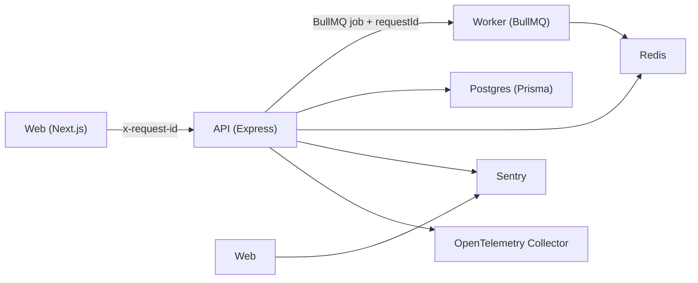

# BirthHub360 Ciclo 1

## Visão geral

O Ciclo 1 estabelece a fundação operacional do monorepo para três apps executáveis: `apps/web`, `apps/api` e `apps/worker`. O objetivo é garantir bootstrap local rápido, contratos fortes de ambiente, segurança mínima padrão e observabilidade suficiente para rastrear uma mesma requisição do navegador até o processamento assíncrono.

## Componentes

## Responsabilidades

- `apps/web`: login inicial, headers de segurança, geração de `requestId`, captura client-side com Sentry e replay de sessão.
- `apps/api`: validação Zod, RFC 7807, CORS allowlist, rate limit por IP, sanitização de mutações, Swagger/OpenAPI e health checks.
- `apps/worker`: consumo BullMQ com correlação de contexto e logging estruturado.
- `packages/config`: contrato central de env vars e payloads compartilhados.
- `packages/database`: schema Prisma inicial, client singleton e seed local.
- `packages/logger`: contexto assíncrono e logger estruturado com `requestId`, `tenantId`, `userId` e `level`.
- `packages/testing`: utilitários para banco de teste isolado e factories.

## Mapa ADR

- `ADR-007`: tenant é injetado no início do request e não é recalculado ao longo da cadeia.
- `ADR-008`: Prisma continua como guarda de aplicação antes de RLS completo.
- `ADR-009`: a nova base convive com apps legados até migração controlada.
- `ADR-011`: autenticação já devolve contexto de role para RBAC posterior.
- `ADR-013`: payloads de job seguem contrato compatível com manifests.
- `ADR-014`: jobs carregam `version` explícita para evolução compatível.
- `ADR-017`: worker recebe contexto suficiente para execução de tools com segurança.
- `ADR-018`: payload assíncrono carrega contexto para policy enforcement.
- `ADR-025`: jobs preservam ganchos para medição de uso no billing.
- `ADR-030`: toda API nova nasce versionada e documentada.
