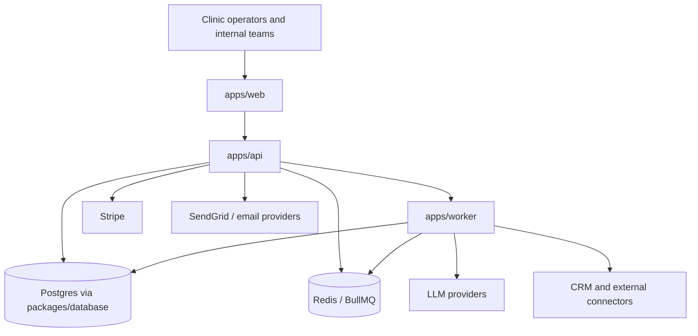

# C4 Context

This document is the stable context-level view of the current BirthHub360 platform.

The supported production lane is:

- `apps/web`: canonical product UI and BFF.
- `apps/api`: authenticated business API, billing, workflows, marketplace and admin control plane.
- `apps/worker`: asynchronous execution, workflow runners, queue consumers and long-running jobs.
- `packages/database`: Prisma schema, migrations and Postgres access layer.
- `packages/*`: shared contracts, config, logging and workflow runtime primitives.

Historical surfaces such as `apps/legacy/dashboard`, `apps/api-gateway` and `apps/agent-orchestrator` remain outside the canonical runtime and must not be used as release evidence.

For the broader container and component views, continue in:

- [C4 model](c4-model.md)
- [F10 architecture](../f10/architecture.md)
