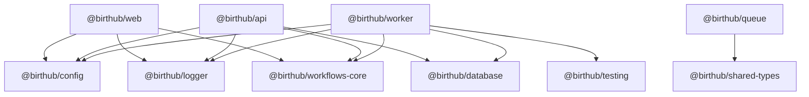

# Internal Package Graph

## Canonical graph

## Notes

- `@birthub/database` é o schema canônico multi-tenant.
- O grafo acima descreve apenas superfícies presentes no `HEAD` atual e suportadas no workspace ativo.
- Referências históricas a `@birthub/db` e `@birthub/api-gateway` devem permanecer apenas em documentação de legado/quarentena, não no grafo canônico atual.
- Dependências internas devem usar `workspace:*` em todos os manifests.
- Mudanças em `package.json` internos exigem atualização do changelog em `docs/release/internal-packages-changelog.md`.
