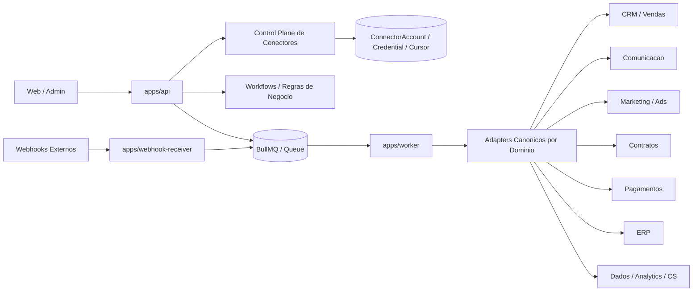

# Plano de Integracoes da Plataforma

## Objetivo

Integrar um grande ecossistema de ferramentas sem acoplar regras de negocio da BirthHub a SDKs e APIs de fornecedores individuais.

O melhor caminho para este repositorio e construir uma **plataforma de conectores por dominio**, e nao sair adicionando integracoes isoladas diretamente no `apps/api`.

## Diagnostico do repositorio

O projeto ja tem uma boa base para isso:

- `apps/api/src/modules/connectors` ja expõe rotas de `connect`, `callback`, `sync` e `list`.
- `packages/database/prisma/schema.prisma` ja possui `ConnectorAccount`, `ConnectorCredential` e `ConnectorSyncCursor`.
- `apps/worker/src/integrations/connectors.runtime.ts` ja trata execucao assincrona para acoes de conector.
- `apps/webhook-receiver` e `apps/worker/src/webhooks/outbound.ts` ja apontam para um modelo event-driven com webhooks, fila e worker.
- `packages/integrations` ja concentra clients/adapters externos.

Hoje, porem, a base ainda esta em fase inicial:

- o catalogo de providers esta hard-coded;
- o OAuth esta modelado so para alguns providers;
- a sincronizacao assíncrona ainda esta muito centrada em casos pontuais;
- parte dos clients atuais ainda funciona como prova de conceito;
- faltam contratos canonicos por dominio para permitir trocar fornecedor sem reescrever a regra de negocio.

## Arquitetura Recomendada

### 1. Control plane de conectores

Responsavel por:

- cadastro do provider;
- credenciais;
- OAuth;
- refresh token;
- scopes;
- status da conexao;
- assinatura de webhooks;
- cursores de sync;
- observabilidade e auditoria.

O que ja existe no schema e nas rotas de `connectors` deve virar o nucleo oficial dessa camada.

### 2. Execution plane assincrono

Responsavel por:

- backfill;
- sync incremental;
- processamento de webhooks;
- retries;
- DLQ;
- rate limit;
- idempotencia;
- reconciliacao.

Essa camada deve rodar no `worker`, nunca no request-response do `api`.

### 3. Adapters canonicos por dominio

Em vez de modelar o sistema por fornecedor, modelar por capacidade:

- `crm`: lead, company, contact, deal, owner, stage, activity.
- `marketing`: audience, campaign, adset, creative, spend, conversion.
- `messaging`: thread, inbound message, outbound message, template, delivery status.
- `calendar`: event, attendee, availability, meeting link.
- `contracts`: template, envelope, signer, signature request, signature status.
- `payments`: customer, invoice, subscription, charge, refund, settlement, webhook event.
- `erp`: customer, supplier, product, service, invoice, receivable, payable, tax document.
- `analytics`: event, session, attribution, report export, metric snapshot.
- `customer-success`: account health, playbook, conversation, ticket, lifecycle event.
- `prospecting`: company enrichment, contact enrichment, intent, ICP fit.

As regras de negocio devem falar com esses contratos canonicos. Os vendors ficam atras dos adapters.

### 4. Camada de automacao

A plataforma deve suportar dois caminhos em paralelo:

- **nativo** para fluxos core do produto;
- **orquestracao externa** para fluxos personalizados e long tail.

Recomendacao:

- usar `n8n` como motor principal de automacao customizavel e sidecar backend;
- usar `Make` e `Zapier` como conectores de extensao, nao como runtime central do produto;
- manter BirthHub como fonte de verdade de conexoes, credenciais, eventos e execucao critica.

## O Que Fazer Nativo vs O Que Fazer via Automacao

| Tipo de integracao | Melhor caminho |
| --- | --- |
| Fluxo core do produto, login por cliente, estado persistente, webhook, sync incremental | Nativo |
| Pagamento, contrato, CRM principal, WhatsApp, agenda, ERP principal | Nativo |
| Casos customizados por cliente, automacoes pontuais, combinacoes raras de apps | n8n |
| Exposicao de editor no-code para usuarios finais | Avaliar n8n com cuidado contratual e de UX |
| PoC rapida ou conectores temporarios | Make ou Zapier |

## Priorizacao Correta

Nao priorizar por quantidade de apps. Priorizar por **jornada de receita e operacao**:

1. Captacao do lead
2. Qualificacao e enriquecimento
3. CRM e cadencia comercial
4. Agendamento e conversa
5. Proposta e assinatura
6. Cobranca e recorrencia
7. Fiscal e ERP
8. Onboarding e customer success
9. Analytics e automacao

## Fases Recomendadas

### Fase 0. Fundacao de integracoes

Antes de crescer o numero de vendors:

- transformar `ConnectorProvider` em catalogo configuravel;
- suportar `oauth`, `api_key`, `service_account`, `basic_auth` e `webhook_secret`;
- implementar refresh token e rotacao de segredo;
- padronizar idempotencia por evento externo;
- padronizar retries, DLQ e tracing por provider;
- criar tabela de subscriptions/webhooks por provider, quando aplicavel;
- criar tabela de mapeamento entre IDs canonicos e IDs externos;
- separar sync manual, sync incremental e backfill completo.

### Fase 1. Core GTM

Comecar pelos providers mais centrais para a operacao comercial:

- Google Workspace
- WhatsApp Business API
- Pipedrive
- HubSpot
- RD Station Marketing
- ActiveCampaign
- Meta Ads
- Google Ads
- LinkedIn Ads

### Fase 2. Fechamento e receita

- Clicksign
- ZapSign
- Autentique
- DocuSign
- Stripe
- Asaas
- Iugu
- Mercado Pago
- PagSeguro
- Vindi

### Fase 3. Backoffice financeiro

- Conta Azul
- Omie
- Bling
- Tiny
- Sankhya
- Totvs

### Fase 4. Dados, CS e prospeccao

- Google Analytics 4
- Metabase
- Power BI
- Intercom
- SenseData
- Apollo.io
- Econodata
- Neoway

### Fase 5. Marketplace e extensibilidade

- publicar catalogo de conectores;
- permitir ativacao self-service;
- expor recipes/templates;
- permitir automacoes por tenant com n8n.

## Providers Ancoras por Dominio

Para evitar explodir escopo, cada dominio deve nascer com 1 ou 2 providers ancora:

- `crm`: HubSpot e Pipedrive
- `calendar`: Google Workspace e Microsoft Graph
- `messaging`: WhatsApp Business API e Slack
- `contracts`: Clicksign e DocuSign
- `payments`: Stripe e Asaas
- `erp`: Omie e Conta Azul
- `marketing automation`: RD Station Marketing e ActiveCampaign
- `ads`: Meta Ads e Google Ads
- `analytics`: GA4 e Metabase

Depois que o contrato canonico estiver estavel, adicionar os demais vendors vira extensao, nao refactor.

## Mudancas Tecnicas Recomendadas Neste Repositorio

### `apps/api/src/modules/connectors`

- mover a lista de providers para um catalogo de capacidades;
- suportar tipos de autenticacao por provider;
- separar `connect`, `install`, `configure webhook`, `refresh`, `disconnect`, `sync`.

### `packages/integrations`

- reorganizar por dominio antes de organizar por fornecedor;
- expor interfaces canonicas;
- deixar SDK/vendor client como detalhe interno;
- adicionar testes de contrato por provider.

### `apps/worker`

- criar jobs especificos por dominio:
  - `connector.sync.crm`
  - `connector.sync.messaging`
  - `connector.sync.analytics`
  - `connector.webhook.ingest`
  - `connector.reconcile`
- persistir resultado, erro, retries e cursor por escopo.

### `apps/webhook-receiver`

- usar como entrada padronizada para eventos externos;
- validar assinatura por provider;
- normalizar payload;
- enfileirar e responder rapido.

## Regra de Ouro

**Nao integrar ferramenta por ferramenta direto no core.**

O caminho que vai escalar para esta lista inteira e:

1. consolidar a plataforma de conectores;
2. modelar contratos canonicos por dominio;
3. fazer nativo o que e core;
4. usar n8n para long tail e automacao custom;
5. crescer por jornadas e providers ancora.

## Proximo Passo Pratico

Se a execucao comecasse agora, a ordem mais segura seria:

1. endurecer a fundacao de `connectors` e `worker`;
2. fechar os dominios canonicos `crm`, `messaging`, `contracts`, `payments` e `analytics`;
3. entregar 8 a 10 integracoes ancora com UX boa;
4. plugar `n8n` como camada de extensibilidade;
5. expandir o catalogo restante sem reescrever o produto.
